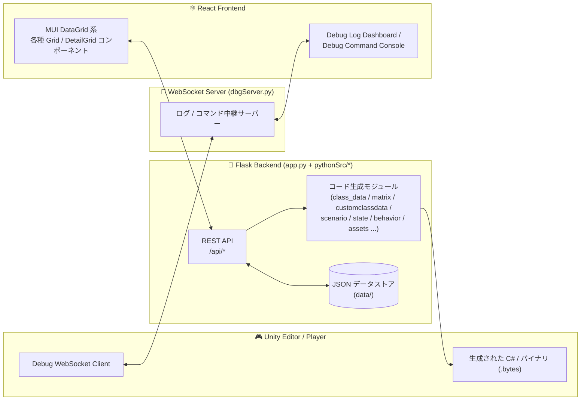

<div align="center">

# 🎮 Game Data Editor Toolchain

**Unity ゲーム開発のためのデータ管理エディタツール**

*Flask + React によるカスタム GUI で、Unity 用の各種マスタデータ・状態・シナリオ・セーブデータ・デバッグ機構を一元管理し、
C#（一部 Python / JS も）コードとバイナリアセットを自動生成する社内ツール*


</div>

---

## 📖 概要

本プロジェクトは、Unity ゲームで使用する **構造化データ（マスタデータ・状態・シナリオ・AI ビヘイビア・セーブデータ等）** を、
ブラウザ上の GUI から編集・生成できるようにした **エディタ拡張ツール** です。

- **バックエンド**：Python / Flask — JSON データの永続化、バイナリシリアライズ、C#（一部 Python / JS）コード自動生成
- **フロントエンド**：React + MUI（`DataGrid`）— テーブル編集・タグ管理・ダイアログベースの UI・遷移図（React Flow）
- **Unity 側**：生成された `.cs` / `.bytes` ファイルをそのまま取り込み、型安全な API として利用可能
- **リアルタイム連携**：WebSocket で Unity ⇔ ブラウザ間のログ／デバッグコマンド送受信

企画・エンジニアが Excel 感覚でデータを編集するだけで、Unity にそのまま組み込める C# コードとバイナリアセットが自動出力されるのが最大の特徴です。

---

## ✨ 機能ハイライト

| カテゴリ | 主な機能 |
|---|---|
| 🗂️ **マスタデータ** | Enum ID / Class Data / Class Data ID / Class Data Matrix ID / Const Class Data |
| 🧩 **拡張データ型** | Custom Class Data（Bit フラグ・Color・Bezier・Dictionary）とその ID テーブル版 |
| 🎬 **シナリオ** | Scenario Role / Event / Conditions、サブイベント・分岐遷移・ロールフォーム自動生成 |
| 🖼️ **アセット管理** | Sound / Texture / GameObject / Material（グループ・サブグループ構造）、Animator、Scene、Addressables |
| 🔄 **ステート & AI** | State（ステートマシン、ライフサイクル/ブランチ/コントロールクラス）、Behavior Tree |
| 💾 **セーブデータ** | SystemData / PlayerData フィールド定義から暗号化対応 `SaveManager` 一式を自動生成 |
| 🐛 **デバッグツール** | WebSocket ベースのリアルタイムログビューア、Debug Command コンソール（Unity 側ディスパッチ基盤も自動生成） |

> 各機能の詳細な仕様・データモデル・生成物・API は [`docs/`](./docs) 以下の個別ドキュメントを参照してください。

---

## 📚 詳細ドキュメント

| ドキュメント | 内容 |
|---|---|
| [docs/01-architecture.md](./readme/01-architecture.md) | 全体アーキテクチャ、起動シーケンス、ディレクトリ構成、モジュール責務分担 |
| [docs/02-master-data.md](./readme/02-master-data.md) | Enum / ClassData / ClassDataID / ClassDataMatrixID / ConstClassData |
| [docs/03-custom-class-data.md](./readme/03-custom-class-data.md) | CustomClassData / CustomClassDataID（Bit・Color・Bezier・Dictionary） |
| [docs/04-scenario.md](./readme/04-scenario.md) | Scenario Role / Event / Conditions、分岐遷移、バイナリ生成 |
| [docs/05-assets.md](./readme/05-assets.md) | Sound / Texture / GameObject / Material / Animator / Scene / Addressables |
| [docs/06-state-behavior.md](./readme/06-state-behavior.md) | State（ステートマシン）と Behavior Tree |
| [docs/07-save-data.md](./readme/07-save-data.md) | SaveData（SystemData / PlayerData）と SaveManager 自動生成 |
| [docs/08-debug-tools.md](./readme/08-debug-tools.md) | Debug Log / Debug Command Console / WebSocket ブリッジ |
| [docs/09-api-reference.md](./readme/09-api-reference.md) | 全 REST API エンドポイント一覧 |

---

## 🏗️ アーキテクチャ概観



詳細は [docs/01-architecture.md](./readme/01-architecture.md) を参照してください。

### 技術スタック

- **Backend**: Python, Flask（Blueprint 分割ルーティング）, `websockets`, `struct`（バイナリ生成）
- **Frontend**: React, MUI (`@mui/x-data-grid`), React Router, React Flow
- **CodeGen**: Python → C# / Python / JS テキスト生成、`struct` によるバイナリシリアライズ
- **Realtime**: WebSocket（Unity ⇔ React のログ／コマンド連携、ポート `8765`）

---

## 📁 フォルダ構成（概略）

```
project-root/
├── app.py                      # コア部分
├── pythonSrc/                  # Flask バックエンドロジック
│   ├── class_data.py           # Enum / ClassData ルート
│   ├── class_data_id.py        # ClassDataID ルート + バイナリ/C#生成 + タグ管理
│   ├── matrix.py               # ClassDataMatrixID
│   ├── customclassdata.py      # Bit/Color/Bezier/Dictionary 拡張型（CustomClassData / ID）
│   ├── state.py                # State（ステートマシン）管理
│   ├── behavior.py / behavior_routes.py  # Behavior Tree（本体 / APIルート）
│   ├── scenario.py             # シナリオ（Role/Event/Conditions/Transition）
│   ├── assets.py               # Sound/Texture/GameObject/Material の CodeGen
│   ├── animation.py            # Animator 管理
│   ├── scene.py                # Scene 管理（GameScene enum 連携）
│   ├── addressableInit.py      # Addressables サポートライブラリ生成
│   ├── savedata.py             # SaveManager 自動生成
│   ├── debugcommand.py         # Debug Command 登録・C#生成
│   ├── dbgServer.py            # WebSocket ログ/コマンド中継サーバー
│   ├── data_utils.py           # 共通データ読み込み・型解決・バイナリ書き込みヘルパー
│   ├── generators.py           # C#/Python/JS 共通コード生成ヘルパー
│   ├── expansion.py            # 拡張ファイルパス解決
│   └── constants.py            # 共有定数（型マッピング等）
│
├── src/                         # React フロントエンド
│   ├── ClassDataGrid.js / ClassDataIdGrid.js / ClassDataIdDetailGrid.js
│   ├── ClassDataMatrixIdGrid.js / ClassDataMatrixIdDetailGrid.js
│   ├── CustomClassDataGrid.js / CustomClassDataIdGrid.js / *DetailGrid.js
│   ├── ConstClassDataGrid.js / ConstClassDataDetailGrid.js
│   ├── EnumIdGrid.js / EnumDetailGrid.js
│   ├── StateGrid.js / StateDetailGrid.js
│   ├── BehaviorGrid.js / BehaviorDetailGrid.js
│   ├── ScenarioRoleGrid.js / ScenarioRoleDetailGrid.js
│   ├── ScenarioEventGrid.js / ScenarioEventTransition.js / ScenarioConditionsGrid.js
│   ├── AnimatorDataGrid.js / AnimatorDataDetailGrid.js
│   ├── SaveDataGrid.js
│   ├── DebugLog.js / DebugCommandConsole.js
│   ├── Flow.js（React Flow 遷移図）
│   └── Sidebar.js / Content.js
│
└── data/                        # 生成される JSON / C# / バイナリ出力先（DATA_DIR）
```

---

## 🚀 セットアップ

### 必要環境
- Python 3.x
- Node.js / npm
- Unity（生成物の取り込み先）

### 起動手順

```bash
# バックエンド（Flask :8000 + WebSocket :8765 が同時起動）
cd pythonSrc
pip install -r requirements.txt
python app.py

# フロントエンド
cd ../frontend
npm install
npm start
```

起動後、ブラウザで開発用 URL（例: `http://localhost:3000`）を開くとエディタ GUI にアクセスできます。
本番ビルド（`npm run build`）を `pythonSrc` 配下の `build/` に配置すると、Flask が静的ファイルとして配信します。

> 実際のディレクトリ名・起動コマンドはプロジェクトの `requirements.txt` / `package.json` の配置に合わせて適宜読み替えてください。

---

<div align="center">

Made with ❤️ for smoother Unity data workflows

</div>
