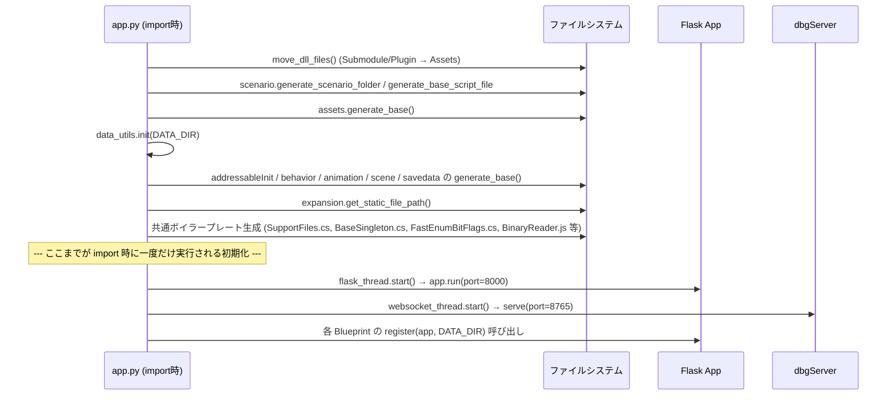

# 🏗️ アーキテクチャ

[← README に戻る](../README.md)

## 1. 全体像

本ツールは大きく 3 つのプロセス/レイヤーで構成されます。

| レイヤー | 実体 | 役割 |
|---|---|---|
| フロントエンド | React（`src/*.js`） | MUI `DataGrid` ベースの編集 UI。REST API を叩いて JSON を取得・更新し、生成系ボタン（バイナリ生成・C#生成など）から Flask のコード生成エンドポイントを呼び出す |
| バックエンド（HTTP） | Flask（`pythonSrc/app.py` + 各モジュール） | JSON データの CRUD、C#/Python/JS コード生成、バイナリシリアライズ。ポート `8000` |
| バックエンド（WebSocket） | `pythonSrc/dbgServer.py` | Unity ⇔ ブラウザ間でデバッグログ・デバッグコマンドをリアルタイム中継。ポート `8765` |

Flask と WebSocket サーバーは `app.py` の `__main__` ブロックで **別スレッド** として同時起動されます。

```python
websocket_thread = threading.Thread(target=dbgServer.mainServer, daemon=True)
flask_thread = threading.Thread(target=flask_main, daemon=True)
flask_thread.start()
websocket_thread.start()
```

---

## 2. モジュール分割方針

もともと `app.py` に全ルートが直書きされていましたが、肥大化を避けるためカテゴリ別に **Flask Blueprint** として切り出されています。

| モジュール | 責務 | 登録方法 |
|---|---|---|
| `pythonSrc/class_data.py` | Enum ID / Class Data | `pythonSrc.class_data.register(app, DATA_DIR)` |
| `pythonSrc/class_data_id.py` | Class Data ID（ID引きテーブル） | `pythonSrc.class_data_id.register(app, DATA_DIR)` |
| `pythonSrc/matrix.py` | Class Data Matrix ID | `pythonSrc.matrix.register(app, DATA_DIR)` |
| `pythonSrc/state.py` | State（ステートマシン） | `pythonSrc.state.register(app, DATA_DIR)` |
| `pythonSrc/behavior_routes.py` | Behavior Tree API（実処理は `behavior.py` に委譲） | `pythonSrc.behavior_routes.register(app, DATA_DIR)` |
| `pythonSrc/customclassdata.py` | Custom Class Data / ID（Bit・Color・Bezier・Dictionary） | `pythonSrc.customclassdata.register(app, DATA_DIR)` |
| `pythonSrc/debugcommand.py` | Debug Command 管理 | `pythonSrc.debugcommand.register(app, DATA_DIR)` |
| `pythonSrc/app.py` | 上記以外すべて（Scenario / Sound / Texture / GameObject / Material / Animator / Scene / SaveData / ConstClassData） | Flask ルートとして直接定義 |

未分離のルートが `app.py` に残っているのは意図的な設計で、「複数モジュールから共有される責務ではない」「分割コストに見合わない」カテゴリはそのまま残置されています。

### 循環 import を避ける工夫

- 各モジュールが共有する定数（ディレクトリ名・型マッピング）は `pythonSrc/constants.py` に集約
- 共有ヘルパー（JSON 読み込み、型解決、バイナリ書き込み、C# フィールド生成）は `pythonSrc/data_utils.py` に集約
- `DATA_DIR` は各モジュールがモジュールグローバル変数として保持し、`register(app, data_dir)` 呼び出し時に注入される（`app.py` を逆 import しない）

---

## 3. 起動シーケンス（`app.py` import 時 / `__main__` 時）



起動時に行われる「プロジェクト用ボイラープレート生成」は **初回のみ**（ファイルが存在しない場合のみ）行われ、既存プロジェクトを上書きしないよう `os.path.exists` チェックが徹底されています。

### ボイラープレートの例

- `Script/SupportFiles.cs` — 代表的なサポートデータファイルのパスを一元管理する静的クラス
- `Script/Editor/` — Unity Editor 拡張の出力先
- `BaseSingleton.cs`, `FastEnumBitFlags.cs` — 共通基底クラス
- `Debug/Log` 用ブリッジ、JS 側 `BinaryReader.js`
- 各カテゴリの基底クラス（`BaseState`, `BaseClassDataID`, `BaseClassDataMatrixID`, `BaseCustomClassData` 等）は、それぞれの担当モジュールの `generate_base(DATA_DIR)` 内で生成される

---

## 4. データディレクトリ構成（`DATA_DIR`）

`DATA_DIR` は実行ファイル（またはリポジトリ）の一つ上の階層の `data/` フォルダに解決されます。

```
data/
├── enum/                          # Enum ID
├── class_data/                    # Class Data
├── class_data_id/                 # Class Data ID（+ タグ定義）
├── class_data_matrix_id/          # Class Data Matrix ID（+ タグ定義）
├── const_class_data/              # Const Class Data
├── state_data/                    # State（ステートマシン）
├── behavior_data/                 # Behavior Tree
├── save_data/                     # SaveManager 本体 + custom_data/（SystemData/PlayerData 定義）
├── scenario_data/
│   ├── scenario_role/             # Scenario Role
│   ├── scenario_event_data/       # Scenario Event（サブイベント・遷移含む）
│   └── scenario_conditions_data/  # Scenario Conditions
├── assets_data/
│   └── anim_data/                 # Animator 定義
├── scene_data/                    # Scene 定義（GameScene enum 連携）
├── debug_command/                 # Debug Command 定義
├── AdressableSupportLib/          # Addressables サポートライブラリ
└── Script/                        # 共通 C# ボイラープレート出力先
    └── Editor/
```

---

## 5. 共通ユーティリティ

### `data_utils.py`
- `get_type_lists()` — Enum / ClassData / ClassDataID の一覧をまとめて取得（型選択の Autocomplete 候補として全 Grid から利用）
- `build_custom_type_info()` — CustomClassData の型解決情報を C# 生成・バイナリ書き込みの両方で使う統一辞書として構築
- `generate_csharp_field()` — 各テーブル系モジュール（class_data / class_data_id / matrix / state）から委譲される **C# フィールド生成の正規ルート**
- `write_binary_field()` / `write_binary_field_extend()` — 型ごとのバイナリシリアライズ処理

### `generators.py`
C# だけでなく **Python / JS 版のコード生成**にも対応しています。

- `generate_class_python` / `generate_class_js` — ClassData の Python / JS クラス表現
- `generate_enum_python` / `generate_enum_js` — Enum の Python（`IntEnum` + ヘルパー関数）/ JS 表現
- `generate_table_python` / `generate_table_js`, `generate_row_python` / `generate_row_js` — テーブルデータの Python / JS 表現
- `generate_js_binary_field` — JS 側でのバイナリ読み込みコード生成（フロントの `BinaryReader.js` と対になる）

これにより、同一のマスタデータ定義から **C#（Unity）／Python（ツール内部・ゲーム内スクリプト等）／JS（フロント表示・簡易ロジック）** の 3 系統のコードを一貫して生成できる設計になっています。

### `expansion.py`
`get_static_file_path()` により、実行環境（開発時 / PyInstaller ビルド時）によって異なる静的ファイルパスを解決します。

---

[← README に戻る](../README.md)
