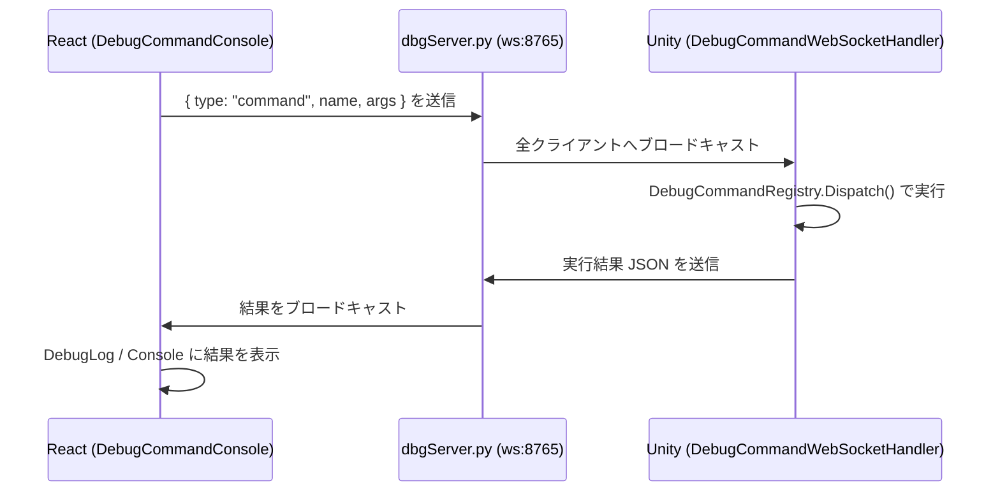

# 🐛 デバッグツール

[← README に戻る](../README.md)

対象コンポーネント: `DebugLog.js`, `DebugCommandConsole.js`
バックエンド: `pythonSrc/dbgServer.py`, `pythonSrc/debugcommand.py`

Unity（C#）とブラウザ（React）を **WebSocket** でリアルタイムに繋ぎ、ログ監視とコマンド実行を可能にする仕組みです。

---

## 1. WebSocket 中継サーバー（`dbgServer.py`）

- `websockets` ライブラリで `ws://localhost:8765` に立てるシンプルな **ブロードキャストサーバー**
- Unity からログや DebugCommand の応答が送られてくると、JSON としてパースし、他の全接続クライアント（React 側）へ転送
- クライアントの接続/切断を `connected_clients` セットで管理し、送信失敗したクライアントは自動的に除外
- `mainServer()` が `app.py` からデーモンスレッドとして起動される

---

## 2. Debug Log（`DebugLog.js`）

Unity からリアルタイムに送られてくるログ（`log` / `warning` / `error`）を受信して表示するダッシュボード。

- WebSocket（`ws://localhost:8765`）に接続し、受信したメッセージを最大 1000 件までバッファ
- 種別ごとの件数カウント（Total / Errors / Warnings / Logs）をチップ表示
- メッセージ本文・種別によるインクリメンタル検索
- 種別に応じたアイコン・背景色（エラー: 赤系 / 警告: 黄系 / ログ: 青系）
- 「Clear Logs」でバッファをクリア

---

## 3. Debug Command（`DebugCommandConsole.js` + `debugcommand.py`）

Unity 側で実行したい任意の処理を「コマンド」として **GUI から登録** し、実行時にブラウザからボタン一つで
Unity に送信・実行・結果受信までを行える仕組みです。

### コマンド定義

- コマンド名、引数リスト（名前 + 型）、任意で戻り値定義（名前 + 型）
- 使用可能な型（`ALLOWED_TYPES`）: `int / uint / float / double / bool / string / vector2 / vector3`

### 生成される C# 基盤（`generate_base(data_dir)` で毎回上書き生成・手動編集不要）

| ファイル | 役割 |
|---|---|
| `DebugCommandJson.cs` | 外部ライブラリに依存しない自前 JSON パーサ/シリアライザ |
| `DebugCommandBase.cs` | コマンドの基底クラス + レジストリ + ディスパッチャ（`DebugCommandRegistry.Dispatch`） |
| `DebugCommandResultBase.cs` | 全コマンド戻り値の基底クラス。実行時刻・コマンド名を自動セット |
| `DebugCommandWebSocketHandler.cs` | Unity 側の WebSocket クライアント本体（下記参照） |

コマンドごとには、以下の 2 段構成でクラスが生成されます（`generate_debug_command_cs`）。

- `Base{Name}DebugCommand : DebugCommandBase` — **毎回上書き生成**される自動生成部分（引数/戻り値の JSON 変換など）
- `{Name}DebugCommand : Base{Name}DebugCommand` — **存在しない場合のみ生成**される手動実装用クラス（実際の処理をここに書く）

### Unity 側の実行フロー（`DebugCommandWebSocketHandler.cs`）

1. シーン内に自動生成される `DebugCommand` という名前の `GameObject` にアタッチ（`RuntimeInitializeOnLoadMethod` で自動配置、Editor / デバッグビルドのみ）
2. `ws://localhost:8765` へ接続し、受信ループ（`ReceiveLoop`）を開始
3. 受信した JSON メッセージを `DebugCommandRegistry.Dispatch()` に渡し、該当コマンドを実行
4. 戻り値があれば JSON にシリアライズしてブラウザへ送信

### API

| メソッド | パス | 用途 |
|---|---|---|
| `GET/POST/PATCH` | `/api/debug-command` | コマンド一覧取得・新規登録・削除 |
| `GET/POST` | `/api/debug-command/<name>` | コマンド詳細取得・保存 |
| `GET` | `/api/debug-command-full` | 全コマンドの詳細情報を一括取得 |
| `POST` | `/api/generate-debug-command/<name>` | 指定コマンドの C# 生成 |
| `POST` | `/api/generate-all-debug-command` | 全コマンドの C# 一括生成 |

---

## 4. 全体フロー図

---

[← README に戻る](../README.md)
